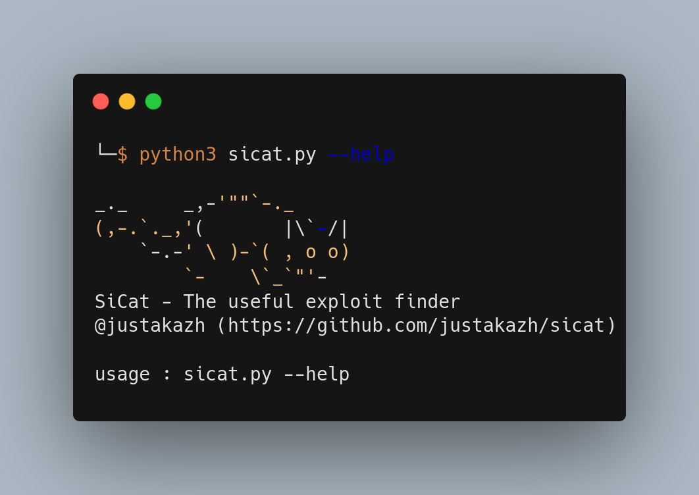

# SiCat - The useful exploit finder


  

## Introduction

SiCat is an advanced exploit search tool designed to identify and gather information about exploits from both open sources and local repositories effectively. With a focus on cybersecurity, SiCat allows users to quickly search online, finding potential vulnerabilities and relevant exploits for ongoing projects or systems.

  

SiCat's main strength lies in its ability to traverse both online and local resources to collect information about relevant exploitations. This tool aids cybersecurity professionals and researchers in understanding potential security risks, providing valuable insights to enhance system security.

  

### SiCat Resources

 - [Exploit-DB](https://www.exploit-db.com/)
 - [Packetstorm Security](https://packetstormsecurity.com/)
 - [Exploit Alert](https://www.exploitalert.com/)
 - [NVD Database](https://nvd.nist.gov/)
 - [Metasploit Modules](https://github.com/rapid7/metasploit-framework/tree/master/modules)

## Installation

``` bash

pip  install  -r  requirements.txt

```

  

## Usage

```bash

~$ python sicat.py --help

  

_._  _,-'""`-._

(,-.`._,'( |\`-/|

`-.-' \ )-`( , o o)

`- \`_`"'-

SiCat - The useful exploit finder

@justakazh (https://github.com/justakazh/sicat)

  

usage : sicat.py --help

usage: sicat.py [-h] [-k KEYWORD] [-kv KEYWORD_VERSION] [-nm NMAP] [--nvd] [--packetstorm] [--exploitdb] [--exploitalert] [--msfmodule] [-o OUTPUT] [-ot OUTPUT_TYPE]

  

Script to search for vulnerability and exploitation information.

  

options:

-h,  --help show this help message and exit

-k KEYWORD, --keyword KEYWORD

File name or path to save the output

-kv KEYWORD_VERSION, --keyword_version KEYWORD_VERSION

File name or path to save the output

-nm NMAP, --nmap NMAP

Identify via nmap output

--nvd Use NVD as a source of information

--packetstorm Use PacketStorm as a source of information

--exploitdb Use ExploitDB as a source of information

--exploitalert Use ExploitAlert as a source of information

--msfmodule Use metasploit module as a source of information

-o OUTPUT, --output OUTPUT

path to save the output

-ot OUTPUT_TYPE, --output_type OUTPUT_TYPE

output file type json and html

```

### Example

  

*From keyword*

```

python sicat -k telerik --exploitdb --msfmodule

```

  

*From nmap output*

```

nmap -sV localhost -oX nmap_out.xml
python sicat -nm nnmap_out.xml --packetstorm

```

## To-do
- [ ] Input from pipeline
- [ ] Search NSE Script

## Contribution

I'm aware that perfection is elusive in coding. If you come across any bugs, feel free to contribute by fixing the code or suggesting new features. Your input is always welcomed and valued.